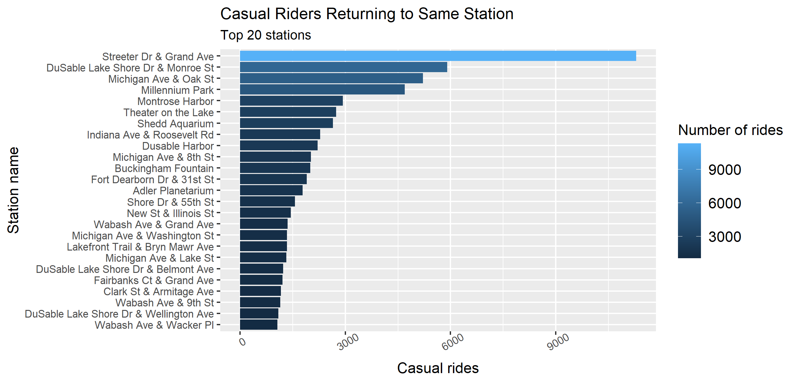
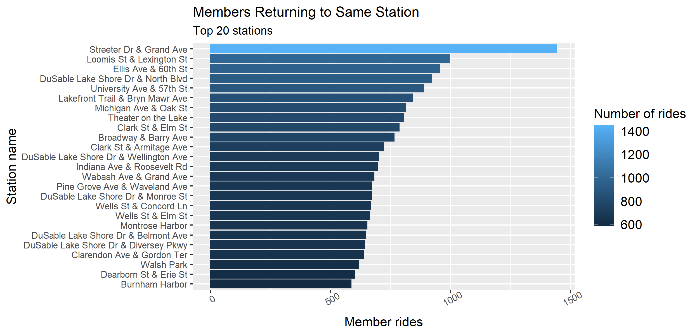

Bike-share: Summary of Analysis
================
Rupika Gopinathan
2022-08-16

## Introduction

### Objective:

Identifying the different bike usage patterns of the casual and member
bike-share riders in order to maximize the number of annual memberships.

 

### Data Source:

Public data made available by Motivate International Inc., link:
<https://divvy-tripdata.s3.amazonaws.com/index.html>.

 

### Metrics used:

Data used for this analysis is of the last 13 months historical data.

Metrics used for analysis are date, number of users (member and casual),
number of rides, and the ride length.

  

# Analysis

Analyzing distinctive bike usage patterns between the casual and member
bike riders.

### 1. Mean of ride length

> Note: Plotting graph to visualize the mean ride duration of casual and
> member riders

Casual riders ride significantly for longer duration than the member
riders.

  

### 2. Total number of riders

More number of rides are taken by members than casual riders, although
not much a significant difference.

  

### 3.Rideable types

> Note: Plotting graph to visualize the different rideable types used by
> casual and member riders

Classic bike is the most preferred amongst the three types of rideables.
Likewise, members tend to use electric and classic bikes more than
casual riders. However, there is no record of docked bike used by
members.

  

### 4. Rides ending in the same station as started

> Note: This section display the plot of top 25 stations the users
> returned to as from where started.

#### For casual riders

Major portion of the casual rides are ending at the same station as
started, which is almost 6 times more than the member rides ending at
the same station. Similarly, Streeter Drive and Grand Avenue is the most
common station traveled to and returned by the users. Casual rides are
significantly greatest to this station than to any other station, which
is a major tourist spot at the heart of Chicago.

  

### 5. Total riders weekly

Notable difference in casual and member riders during weekdays and
weekends. Member rides are predominantly through Monday to Thursday, on
the contrary, casual rides are significant from Friday and peaks largely
on the weekends.

  

### 6. Mean duration of the rides week wise

Casual users ride for outstandingly longer time than members. Moreover,
non-members ride for longer duration throughout the weekend.

 

## Conclusion

**The trends suggest that most of the casual riders are visitors as
there tend to be an increase in number of casual riders from July to
August (vacation season), as well as through weekends all year.**

**On the other hand, the increased number of member rides round the year
does not clearly states that the number of members are more than casual
riders, as these rides can be taken by the same user multiple times.**

**Classic bike appears to be the most favorable rideable-type by both
the user types. However, among the casual riders the difference in
electric bike and classic bike usage is fairly at odds.**

  

## Recommendations

1.  Multiple membership plans:

    Providing users with several choices could attract more visitors in
    signing up for membership.

2.  Focus on ride length/duration:

    Special membership perks for riding at least 30 minutes in a day; as
    the least ride duration by casual users are around 32 mins.

3.  Advertising:

    The top three most visited stations by casual users can be used for
    maximum advertisements and pitch-ins, such as posters, sales person
    pitch-ins, or an advertisement on a TV.

4.  Classic bike:

    The most preferred among the rideable types is Classic and Electric
    bike. Increasing the number of these bikes at the listed top 20
    stations, with a special rate membership plan.

  

## Areas for further exploration

1.  Unique member user ids are not available, thus, exact count of
    members cannot be known

2.  Age group of the riders to focus on

3.  Different rideable type description, details about “docked type”
    rideable

4.  Missing values and NAs.

 

## Limitations

Data-privacy issues prohibit from using riders' personally identifiable
information. This means that one won't be able to connect pass purchases
to credit card numbers to determine if casual riders live in the
bike-share service area or if they have purchased multiple single
passes.
