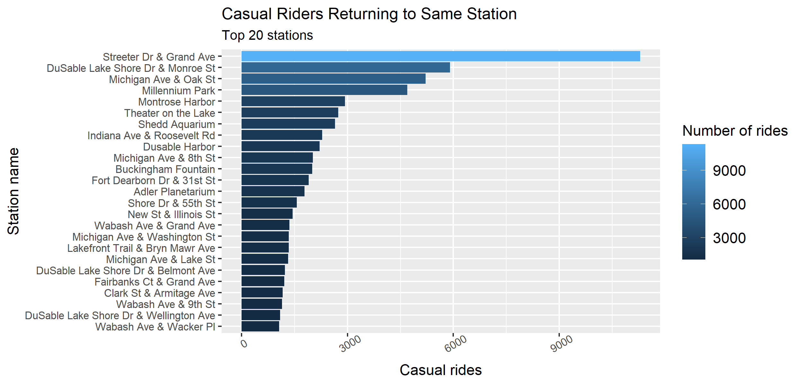

# Cyclistic Data: Summary of Analysis

## Introduction

### Objective:

Identifying the different bike usage patterns of the casual and member Cyclistic riders in order to maximize the number of annual memberships.

 

### Data Source:

Public data made available by Motivate International Inc., link: <https://divvy-tripdata.s3.amazonaws.com/index.html>.

 

### Purpose and Metrics used:

Data used for this analysis is of the last 13 months historical data to study the trends.

Metrics used for analysis are date, number of users (member and casual), number of rides, and the ride length.

   

### Load data for Analysis

Note: Loading 13 months `csv` Cyclistic dataset for analysis, by creating a `function`

  

  

# Analysis

Analyzing the difference in usage of the casual and member bike riders.

## Plots

### 1. Mean of ride length

> Note: Plotting graphs to visualize the mean ride duration of casual and member riders

  

### 2. Total number of riders

  

### 3.Rideable types

Note: Plotting graph to visualize the different rideable types used by casual and member riders

  

### 4. Rides ending in the same station as started

Note: This section display the plot of top 25 stations the users returned to as from where started.

#### For casual riders

 

#### For member riders

 

  

  

## Conclusion

Inference from the plots:

1.  Casual riders ride significantly for longer duration than the Cyclistic member riders.

2.  More number of rides are taken by members than casual riders, although not much a significant difference.

3.  Classic bike is the most preferred amongst the three types of rideables. Likewise, members tend to use electric and classic bikes more than casual riders. However, there is no record of docked bike used by members.

4.  Major portion of the casual rides are ending at the same station as started, which is almost 6 times more than the member rides ending at the same station. Similarly, Streeter Drive and Grand Avenue is the most common station traveled to and returned by the users. Casual rides are significantly greatest to this station than to any other station, which is a major tourist spot at the heart of Chicago.

Findings:

**We can with supportive evidence of trends as seen in the analysis plot hypothesize, most of the casual riders are tourists, or locals with the purpose of sight-seeing as there tend to be an increase in number of casual riders from July to August (Summer season), which is the time to experience most tourists.**

**On the other hand, the increased number of member rides round the year does not clearly states that the number of members are more than casual riders, as these rides can be taken by the same user multiple times in a day.**

**Classic bike appears to be the most favorable rideable-type bike by both the user types. However, among the casual riders the difference in electric bike and classic bike usage is fairly at odds**.

  

  

## Areas for further exploration:

-   Unique member user ids are not available, thus, exact count of members cannot be known

-   Age group of the riders to focus on?

-   Different rideable type description, what is exactly "docked type" rideable?

-   Why is there missing values and NAs? Does the rows needs to be included or excluded while data wrangling?
