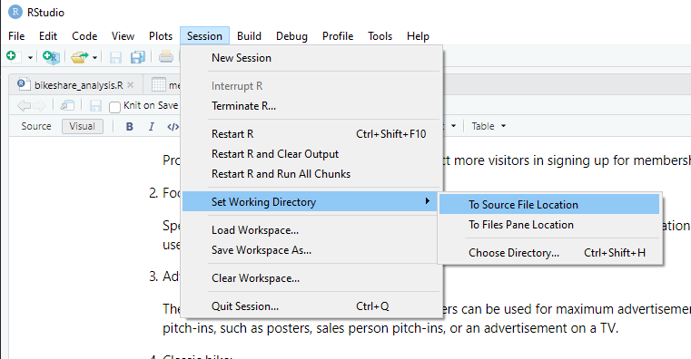

# Bikeshare Analysis

Analyze bikeshare data to maximize the number of annual memberships. The objective is to understand how casual riders and annual members use bikes differently.

## Project Setup

### Prerequisites

Download and install R from [here](https://cran.r-project.org/mirrors.html)

Click "Session->Set Working Directory->To Source File Location" in RStudio.



### Libraries

Install the following R libraries.

```r
install.packages(tidyverse)
install.packages(dplyr)
install.packages(readr)
install.packages(janitor)
install.packages(rlang)
install.packages(lubridate)
install.packages(ggplot2)
```

Select the source file (`Ctrl+A`) and press `CTRL+Enter` to run the script.

## Creating Report

Download the bikeshare raw data from [here](https://divvy-tripdata.s3.amazonaws.com/index.html) and extract the csv files.

If using R Studio, open the R script [bikeshare_analysis.R](bikeshare_analysis.R) and press `CTRL+ALT+R` to run the R script. This will generate the visualizations to show usage patterns of member and casual riders.

[Sample Report](Cyclist_Analysis_summary.md) of bikeshare data from June 2021 to June 2022